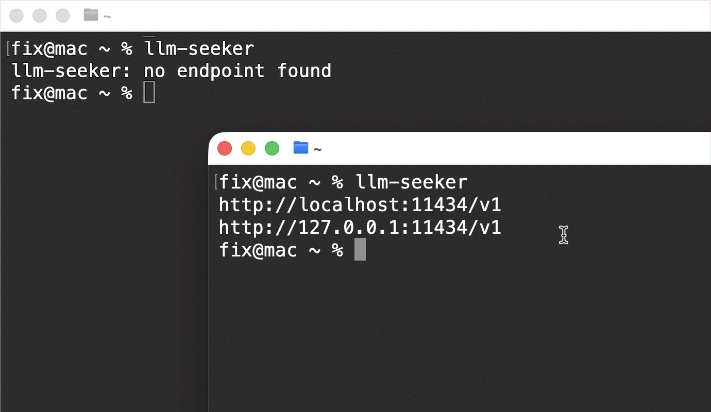

# LLM-Seeker

## Discover OpenAI-compatible LLM endpoints



### Overview

llm-seeker is a tiny CLI utility that automatically discovers OpenAI-compatible LLM endpoints on your machine.
Useful when working with Ollama, LM Studio, vLLM, or any local LLM server.

### Install
Requires Go. Install:

```bash
go install github.com/fixdot/llm-seeker@latest
Binary will be installed to: $GOPATH/bin (usually ~/go/bin)
```

### Usage
Make sure your local OpenAI-compatible LLM server is running.
```bash
llm-seeker
```

### Example output
```text
http://localhost:11434/v1
http://127.0.0.1:11434/v1
```


### Exit codes

0 — endpoint found  
1 — no endpoint found  
2 — internal error

### Environment

LLM_SEEKER_PORTS — override default port list (comma-separated)

### License

MIT License

### Links

**Project page**  
https://github.com/fixdot/llm-seeker

